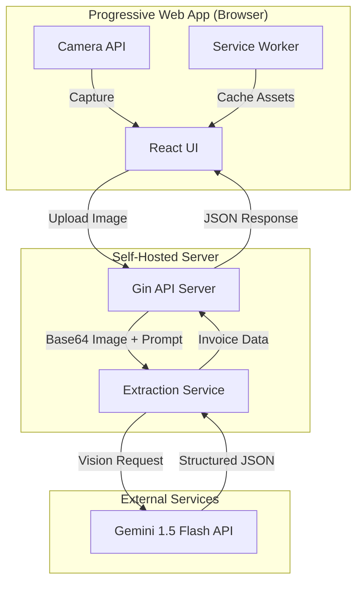

# Invoice Scan MVP - System Design & Architecture

## Architecture Overview

**What is the high-level system structure?**



### Technology Stack

| Layer | Technology | Rationale |
|-------|------------|-----------|
| **Frontend** | React 18+ with TypeScript | Component-based, type safety, wide ecosystem |
| **State Management** | Zustand | Lightweight, simple API, no boilerplate |
| **Routing** | React Router v6 | Standard, well-supported, simple |
| **Forms** | React Hook Form | Performance, validation, minimal re-renders |
| **Data Fetching** | TanStack Query | Caching, retries, loading states, optimistic updates |
| **Styling** | Tailwind CSS | Already used in mockups, utility-first, fast development |
| **Build Tool** | Vite | Fast builds, excellent PWA plugin support |
| **PWA** | vite-plugin-pwa | Easy service worker generation, manifest handling |
| **Icons** | Material Symbols | Already in mockups, consistent design |
| **Backend** | Go 1.21+ with Gin | Fast, efficient, good concurrency, simple API |
| **AI/ML** | Gemini 1.5 Flash API | Best cost/performance for Vietnamese handwriting |
| **Monorepo** | pnpm workspaces | Fast, efficient, good TypeScript support |
| **Hosting** | Self-hosted (Docker) | As per requirement, full control |

## Monorepo Structure

**How is the project organized?**

```
invoice-scan/
├── frontend/                    # React PWA
│   ├── src/
│   │   ├── components/
│   │   ├── hooks/
│   │   ├── services/
│   │   ├── stores/              # Zustand stores
│   │   ├── types/
│   │   └── ...
│   ├── public/
│   ├── package.json
│   ├── vite.config.ts
│   └── tsconfig.json
├── backend/                     # Golang API
│   ├── cmd/
│   │   └── server/
│   │       └── main.go          # Application entry point
│   ├── internal/
│   │   ├── handlers/            # HTTP handlers
│   │   ├── services/            # Business logic
│   │   ├── models/              # Data models
│   │   └── config/              # Configuration
│   ├── pkg/                     # Public packages (if needed)
│   ├── go.mod
│   ├── go.sum
│   └── Dockerfile
├── shared/                      # Shared types (optional)
│   └── types/
│       ├── invoice.ts           # TypeScript types
│       └── invoice.go           # Go types (or generate from TS)
├── docker-compose.yml
├── pnpm-workspace.yaml          # pnpm workspace config
├── package.json                 # Root package.json
└── README.md
```

## Data Models

**What data do we need to manage?**

### Flexible Invoice Data Structure

The system uses a flexible structure to support various invoice formats:

```typescript
interface InvoiceData {
  keyValuePairs: KeyValuePair[];
  table?: TableData;
  summary: KeyValuePair[];
  metadata: ExtractionMetadata;
}

interface KeyValuePair {
  key: string;
  value: string;
}

interface TableData {
  headers: string[];
  rows: TableRow[];
}

interface TableRow {
  id: string;
  cells: string[];
}

interface ExtractionMetadata {
  processedAt: string;
  modelUsed: string;
  confidence?: number;
}
```

### Go Equivalent Types

```go
type InvoiceData struct {
    KeyValuePairs []KeyValuePair `json:"keyValuePairs"`
    Table         *TableData     `json:"table,omitempty"`
    Summary       []KeyValuePair `json:"summary"`
    Metadata      Metadata       `json:"metadata"`
}

type KeyValuePair struct {
    Key   string `json:"key"`
    Value string `json:"value"`
}

type TableData struct {
    Headers []string   `json:"headers"`
    Rows    []TableRow `json:"rows"`
}

type TableRow struct {
    ID    string   `json:"id"`
    Cells []string `json:"cells"`
}

type Metadata struct {
    ProcessedAt string  `json:"processedAt"`
    ModelUsed   string  `json:"modelUsed"`
    Confidence  *float64 `json:"confidence,omitempty"`
}
```

### API Request/Response

```typescript
interface ExtractInvoiceRequest {
  image: string;
}

interface ExtractInvoiceResponse {
  success: boolean;
  data?: InvoiceData;
  error?: string;
}
```

## API Design

**How do components communicate?**

### Endpoints

#### POST `/api/extract`
Extract invoice data from an uploaded image.

**Request:**
```json
{
  "image": "data:image/jpeg;base64,/9j/4AAQSkZJRg..."
}
```

**Response (Success):**
```json
{
  "success": true,
  "data": {
    "keyValuePairs": [
      { "key": "Vendor", "value": "Công ty ABC" },
      { "key": "Invoice #", "value": "HD-2024-001" },
      { "key": "Date", "value": "2024-01-15" }
    ],
    "table": {
      "headers": ["Item", "Qty", "Price", "Total"],
      "rows": [
        {
          "id": "1",
          "cells": ["Giấy A4", "5", "50,000", "250,000"]
        },
        {
          "id": "2",
          "cells": ["Bút bi", "10", "5,000", "50,000"]
        }
      ]
    },
    "summary": [
      { "key": "Subtotal", "value": "300,000" },
      { "key": "Tax", "value": "30,000" },
      { "key": "Total", "value": "330,000" }
    ],
    "metadata": {
      "processedAt": "2024-01-15T10:30:00Z",
      "modelUsed": "gemini-1.5-flash"
    }
  }
}
```

**Response (Error):**
```json
{
  "success": false,
  "error": "Failed to process image. Please try again."
}
```

#### GET `/api/health`
Health check endpoint for monitoring.

**Response:**
```json
{
  "status": "ok",
  "timestamp": "2024-01-15T10:30:00Z"
}
```

## Component Breakdown

**What are the major building blocks?**

### Frontend Components

```
frontend/src/
├── components/
│   ├── camera/
│   │   ├── CameraView.tsx         # Camera feed and capture
│   │   ├── CaptureButton.tsx      # Shutter button
│   │   └── FrameGuide.tsx         # Dashed rectangle overlay
│   ├── verify/
│   │   ├── VerifyView.tsx         # Main verification screen
│   │   ├── InvoiceImage.tsx       # Zoomable invoice preview
│   │   ├── KeyValueSection.tsx   # Key-value pairs (collapsible)
│   │   ├── TableSection.tsx      # Table with dynamic columns
│   │   ├── SummarySection.tsx    # Summary fields (collapsible)
│   │   └── EditableField.tsx     # Reusable editable field component
│   └── common/
│       ├── Header.tsx             # App header with navigation
│       ├── LoadingSpinner.tsx     # Loading state
│       └── ErrorMessage.tsx       # Error display
├── hooks/
│   ├── useCamera.ts               # Camera access and capture
│   └── useExtractInvoice.ts       # API call to extract invoice (TanStack Query)
├── stores/
│   └── invoiceStore.ts            # Zustand store for invoice state
├── services/
│   └── api.ts                     # API client (TanStack Query setup)
├── types/
│   └── invoice.ts                 # TypeScript interfaces
├── App.tsx                        # Main app with routing
└── main.tsx                       # Entry point
```

### Backend Structure (Go/Gin)

```
backend/
├── cmd/
│   └── server/
│       └── main.go                # Application entry point
├── internal/
│   ├── handlers/
│   │   ├── extract.go            # POST /api/extract handler
│   │   └── health.go             # GET /api/health handler
│   ├── services/
│   │   └── gemini.go              # Gemini API integration
│   ├── models/
│   │   └── invoice.go            # Data models
│   ├── config/
│   │   └── config.go             # Configuration management
│   └── middleware/
│       ├── cors.go                # CORS middleware
│       └── logger.go              # Logging middleware
├── pkg/                           # Public packages (if needed)
├── go.mod
├── go.sum
└── Dockerfile
```

## Design Decisions

**Why did we choose this approach?**

### Decision 1: Gemini 1.5 Flash over Claude/GPT-4

**Choice**: Gemini 1.5 Flash
**Alternatives Considered**: Claude 3 Haiku, GPT-4 Vision
**Rationale**:
- 10x cheaper than alternatives (~$0.20 per 1,000 invoices)
- Excellent Vietnamese language support (Google's extensive Vietnamese training)
- Good handwriting recognition (inherits Google OCR expertise)
- Adequate speed for real-time use

### Decision 2: React + Vite over Next.js

**Choice**: React SPA with Vite
**Alternatives Considered**: Next.js, plain HTML/JS
**Rationale**:
- Simpler deployment (static files + separate API)
- No SSR needed for this use case
- Vite has excellent PWA plugin
- Matches existing mockup structure

### Decision 3: Zustand over Redux/Context API

**Choice**: Zustand
**Alternatives Considered**: Redux Toolkit, Context API, Jotai
**Rationale**:
- Minimal boilerplate
- Simple API, easy to learn
- Good TypeScript support
- Small bundle size
- Sufficient for MVP scope

### Decision 4: TanStack Query over SWR/fetch

**Choice**: TanStack Query (React Query)
**Alternatives Considered**: SWR, plain fetch
**Rationale**:
- Excellent caching and background updates
- Built-in loading/error states
- Retry logic out of the box
- Optimistic updates support
- Great DevTools

### Decision 5: Go/Gin over Node.js/Express

**Choice**: Go with Gin framework
**Alternatives Considered**: Node.js + Express, Python + FastAPI
**Rationale**:
- Better performance and lower memory usage
- Excellent concurrency (goroutines)
- Strong typing and compile-time safety
- Single binary deployment
- Good ecosystem for API services

### Decision 6: pnpm Workspaces over npm/yarn

**Choice**: pnpm workspaces
**Alternatives Considered**: npm workspaces, yarn workspaces, Turborepo
**Rationale**:
- Fast installation and linking
- Efficient disk usage (content-addressable storage)
- Good TypeScript support
- Simple configuration
- Works well for monorepos

### Decision 7: Flexible Data Model over Fixed Schema

**Choice**: Dynamic structure (key-value pairs, table, summary)
**Alternatives Considered**: Fixed schema with predefined fields
**Rationale**:
- Supports various invoice formats
- No need to update schema for new invoice types
- More flexible for future expansion
- Matches real-world invoice diversity

### Decision 8: Single API Endpoint

**Choice**: One `/api/extract` endpoint
**Alternatives Considered**: Separate upload + process endpoints
**Rationale**:
- Simplest possible architecture
- No need to store images (privacy benefit)
- Reduces latency (no intermediate storage)
- Stateless processing

### Decision 9: Base64 Image Encoding

**Choice**: Send image as base64 in JSON body
**Alternatives Considered**: multipart/form-data upload
**Rationale**:
- Simpler client and server code
- No file handling on server
- Direct pass-through to Gemini API (also uses base64)
- Works well for small to medium images

## Gemini Prompt Design

**Prompt for Flexible Vietnamese Invoice Extraction:**

```
Bạn là chuyên gia trích xuất dữ liệu hóa đơn. Phân tích hình ảnh hóa đơn này và trích xuất thông tin theo định dạng JSON linh hoạt.

Hóa đơn thường có 3 phần:
1. PHẦN KEY-VALUE (đầu hóa đơn): Các thông tin metadata như tên nhà cung cấp, số hóa đơn, ngày tháng, địa chỉ, v.v.
2. PHẦN BẢNG (giữa hóa đơn): Bảng với header và các dòng dữ liệu (items, số lượng, giá, v.v.)
3. PHẦN TỔNG KẾT (cuối hóa đơn): Các tổng, thuế, giảm giá, tổng cộng, v.v.

Trích xuất theo cấu trúc JSON sau:
{
  "keyValuePairs": [
    {"key": "Tên trường", "value": "Giá trị"}
  ],
  "table": {
    "headers": ["Cột 1", "Cột 2", ...],
    "rows": [
      {"id": "1", "cells": ["Giá trị 1", "Giá trị 2", ...]}
    ]
  },
  "summary": [
    {"key": "Tên trường", "value": "Giá trị"}
  ]
}

Lưu ý:
- Nếu không có phần bảng, bỏ qua trường "table"
- Trích xuất tất cả các trường có thể đọc được
- Giữ nguyên định dạng số tiền (có thể có dấu phẩy, chấm)
- Ngày tháng giữ nguyên định dạng trong hóa đơn
- Nếu không đọc được trường nào, bỏ qua trường đó

Output JSON only, no markdown formatting.
```

## Non-Functional Requirements

**How should the system perform?**

### Performance Targets
| Metric | Target |
|--------|--------|
| Image upload + extraction | < 5 seconds (p95) |
| PWA initial load | < 3 seconds on 4G |
| PWA cached load | < 1 second |
| Camera to preview | < 500ms |
| API response time | < 100ms (excluding Gemini call) |

### Scalability
- MVP designed for single-user/low-traffic use
- Stateless API allows horizontal scaling if needed later
- Gemini API handles heavy lifting (no local ML)
- Go's concurrency model supports high throughput

### Security Requirements
| Requirement | Implementation |
|-------------|----------------|
| HTTPS | Required for camera access, Let's Encrypt |
| No image storage | Images processed in-memory only |
| API key security | Environment variable, never exposed to client |
| CORS | Restrict to PWA domain only |
| Input validation | Validate base64 image size and format |

### Reliability
- Simple architecture minimizes failure points
- Graceful error handling in UI
- Retry capability for failed extractions
- Go's error handling promotes explicit error checking
