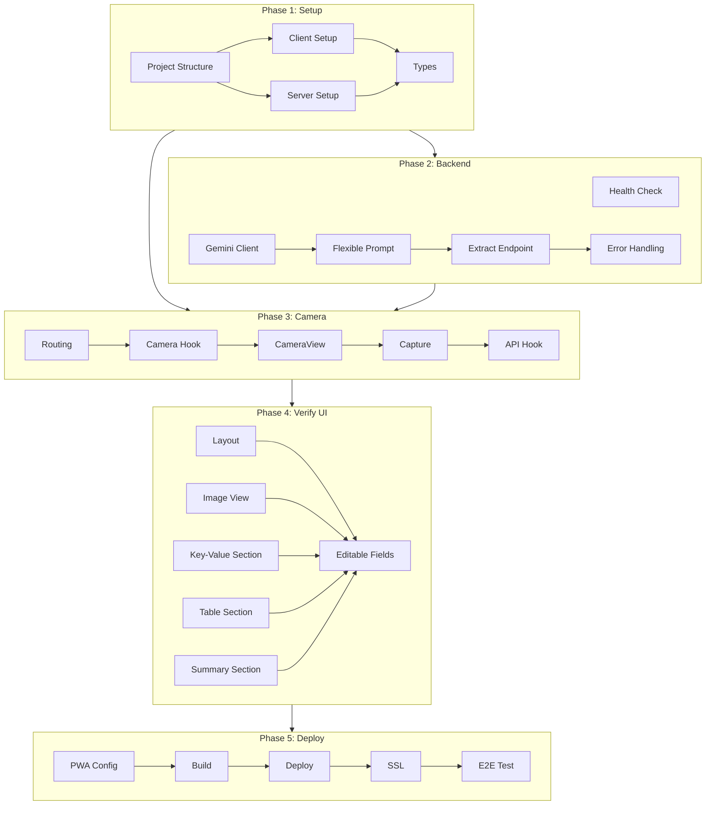

# Invoice Scan MVP - Project Planning & Task Breakdown

## Milestones

**What are the major checkpoints?**

- [ ] **Milestone 1**: Project Setup & Infrastructure
- [ ] **Milestone 2**: Backend API with Gemini Integration
- [ ] **Milestone 3**: Frontend Camera & Capture
- [ ] **Milestone 4**: Verification UI (Display extracted data alongside image)
- [ ] **Milestone 5**: PWA & Deployment

## Task Breakdown

**What specific work needs to be done?**

### Phase 1: Project Setup

- [ ] **Task 1.1**: Initialize project structure (client + server)
- [ ] **Task 1.2**: Setup React + Vite + TypeScript client with Tailwind CSS
- [ ] **Task 1.3**: Setup Node.js + Express + TypeScript server
- [ ] **Task 1.4**: Create flexible TypeScript types for dynamic invoice data
- [ ] **Task 1.5**: Setup Docker configuration for deployment

### Phase 2: Backend API

- [ ] **Task 2.1**: Implement health check endpoint
- [ ] **Task 2.2**: Setup Gemini API client
- [ ] **Task 2.3**: Design extraction prompt for flexible invoice formats
  - Support key-value extraction
  - Support table data extraction (dynamic columns)
  - Support summary section extraction
  - Vietnamese language optimization
- [ ] **Task 2.4**: Implement extract endpoint with flexible response structure
- [ ] **Task 2.5**: Add error handling and validation
- [ ] **Task 2.6**: Configure CORS and basic security

### Phase 3: Frontend Camera

- [ ] **Task 3.1**: Setup routing (Home → Scan → Verify flow)
- [ ] **Task 3.2**: Implement camera access hook
- [ ] **Task 3.3**: Build CameraView component with frame guide
- [ ] **Task 3.4**: Build camera controls (capture, flash, close)
- [ ] **Task 3.5**: Implement image capture and compression
- [ ] **Task 3.6**: Implement API integration hook

### Phase 4: Verification UI

- [ ] **Task 4.1**: Build VerifyView layout (image + extracted data side by side)
- [ ] **Task 4.2**: Build InvoiceImage component (zoomable preview)
- [ ] **Task 4.3**: Build KeyValueSection component (dynamic key-value pairs)
- [ ] **Task 4.4**: Build TableSection component (dynamic columns + rows)
- [ ] **Task 4.5**: Build SummarySection component (totals, etc.)
- [ ] **Task 4.6**: Implement editable fields for all sections
- [ ] **Task 4.7**: Add loading and error states

### Phase 5: PWA & Deployment

- [ ] **Task 5.1**: Configure PWA manifest and icons
- [ ] **Task 5.2**: Setup service worker for caching
- [ ] **Task 5.3**: Build production assets
- [ ] **Task 5.4**: Deploy to self-hosted server
- [ ] **Task 5.5**: Configure SSL (HTTPS required for camera)
- [ ] **Task 5.6**: End-to-end testing on devices

## Dependencies

**What needs to happen in what order?**



### External Dependencies

| Dependency | Required For | Notes |
|------------|--------------|-------|
| Google Cloud Account | Gemini API | Enable billing, get API key |
| Domain Name | PWA, HTTPS | Required for camera access |
| SSL Certificate | HTTPS | Let's Encrypt (free) |
| Server/VPS | Deployment | Any Linux server with Docker |

## Key Design Considerations

**Flexible Invoice Data Model**

The extraction prompt and UI must handle dynamic structures:

```
Invoice Data (Flexible)
├── Key-Value Pairs (array)
│   ├── { key: "Vendor", value: "ABC Company" }
│   ├── { key: "Invoice #", value: "INV-001" }
│   └── ... (any number of pairs)
├── Table
│   ├── Headers: ["Item", "Qty", "Price", "Total"]  ← dynamic
│   └── Rows: [
│         ["Paper", "5", "10,000", "50,000"],
│         ["Pen", "10", "2,000", "20,000"]
│       ]
└── Summary (array)
    ├── { key: "Subtotal", value: "70,000" }
    ├── { key: "Tax", value: "7,000" }
    └── { key: "Total", value: "77,000" }
```

## Timeline & Estimates

**Rough time allocation per phase**

| Phase | Description | Estimated Effort |
|-------|-------------|------------------|
| Phase 1 | Project Setup | 1 day |
| Phase 2 | Backend API | 1-2 days |
| Phase 3 | Frontend Camera | 1-2 days |
| Phase 4 | Verification UI | 1-2 days |
| Phase 5 | PWA & Deployment | 1 day |

**Total**: ~5-8 days depending on complexity

## Risks & Mitigation

**What could go wrong?**

| Risk | Probability | Impact | Mitigation |
|------|-------------|--------|------------|
| Gemini extraction varies by format | Medium | High | Design flexible UI, allow easy edits |
| Dynamic table rendering complex | Medium | Medium | Start simple, iterate on UI |
| Vietnamese handwriting accuracy | Medium | Medium | Clear verification UI, easy corrections |
| Camera API browser compatibility | Low | Medium | Test on target devices early |

## Resources Needed

**What do we need to succeed?**

### Accounts & Services
- [ ] Google Cloud account with Gemini API enabled
- [ ] Domain name (or subdomain)
- [ ] Server/VPS for self-hosting

### Test Materials
- [ ] Various invoice formats (office supplies, restaurant, utility, etc.)
- [ ] Printed Vietnamese invoices
- [ ] Handwritten Vietnamese invoices
- [ ] iOS and Android devices for testing
