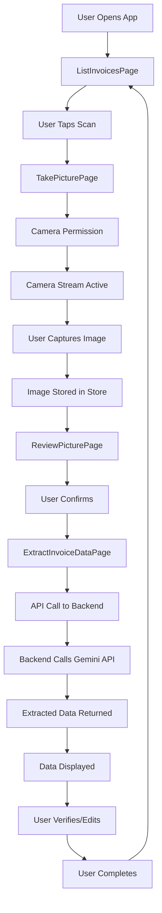
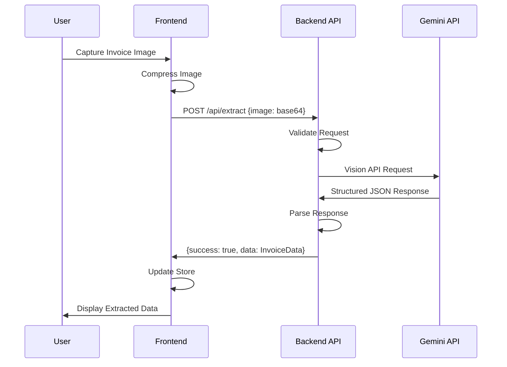

# System Architecture

**Last Updated**: 2025-12-06
**Version**: 1.0.0
**Project**: Invoice Scan MVP

## Overview

Invoice Scan MVP implements a client-server architecture with a React Progressive Web App frontend and a planned backend API server. The system leverages Google's Gemini Vision API for AI-powered invoice data extraction, supporting flexible schema extraction for various invoice formats, with special optimization for Vietnamese language content.

## Architectural Pattern

### Pattern Classification
**Primary Pattern**: Client-Server Architecture with PWA
**Secondary Patterns**:
- Progressive Web App (PWA) pattern
- RESTful API pattern
- Component-based UI architecture
- State management with Zustand
- Data fetching with TanStack Query

### Design Philosophy
- **Mobile-First**: Designed for mobile devices with progressive enhancement
- **Offline-Capable**: Service worker enables offline functionality
- **Type-Safe**: Full TypeScript coverage for type safety
- **Performance-Optimized**: Code splitting, image compression, lazy loading
- **Privacy-First**: No image storage, in-memory processing only

## System Components

### 1. Frontend Layer (React PWA)

#### 1.1 Application Shell
**Location**: `frontend/src/App.tsx`
**Responsibility**: Main application structure and routing
**Key Functions**:
- Route configuration
- Query client provider setup
- Global layout structure
- Navigation management

**Technology**: React 19.2.0, React Router 7.9.6

#### 1.2 Page Components
**Location**: `frontend/src/pages/`
**Components**:
- `ListInvoicesPage.tsx` - Landing page with invoice list
- `TakePicturePage.tsx` - Camera interface for invoice capture
- `ReviewPicturePage.tsx` - Image preview and confirmation
- `ExtractInvoiceDataPage.tsx` - Data extraction and verification interface

**Responsibilities**:
- User interface rendering
- User interaction handling
- Navigation between flows
- State management integration

#### 1.3 Custom Hooks
**Location**: `frontend/src/hooks/`
**Hooks**:
- `useCamera.ts` - Camera stream management and image capture
- `useInvoiceExtraction.ts` - API integration for data extraction
- `usePWANavigation.ts` - PWA-specific navigation handling
- `usePWARouter.ts` - Router configuration for PWA

**Responsibilities**:
- Encapsulate reusable logic
- Manage side effects
- Provide clean APIs to components
- Handle error states

#### 1.4 State Management
**Location**: `frontend/src/stores/app-store.ts`
**Technology**: Zustand 5.0.8
**State Structure**:
```typescript
{
  currentImage: string | null;
  extractedData: InvoiceData | null;
  isLoading: boolean;
  error: string | null;
}
```

**Responsibilities**:
- Global application state
- State update methods
- State persistence (if needed)
- Cross-component communication

#### 1.5 API Client
**Location**: `frontend/src/lib/api.ts`
**Technology**: Fetch API with TypeScript
**Responsibilities**:
- HTTP request handling
- Error handling and transformation
- Request/response type safety
- Base URL configuration

#### 1.6 Service Worker
**Location**: Generated by vite-plugin-pwa
**Technology**: Workbox
**Responsibilities**:
- Asset caching
- Offline support
- Background sync (future)
- Push notifications (future)

### 2. Backend Layer (Planned)

#### 2.1 API Server
**Location**: `backend/` (planned)
**Technology**: Go 1.21+ with Gin framework (planned)
**Responsibilities**:
- RESTful API endpoints
- Request validation
- Response formatting
- Error handling

#### 2.2 Extraction Service
**Location**: `backend/internal/services/` (planned)
**Technology**: Google Gemini Go SDK
**Responsibilities**:
- Gemini API integration
- Image processing
- Prompt engineering
- Response parsing

#### 2.3 Configuration Management
**Location**: `backend/pkg/config/`
**Technology**: Viper with YAML and environment variable support
**Responsibilities**:
- Environment variable loading (automatic with dot-to-underscore mapping)
- YAML configuration file support (`config.yaml`)
- API key management (Gemini API key)
- Server configuration (host, port)
- CORS configuration
- Database configuration (host, port, user, password, name)
- Configuration access via dot notation (e.g., `config.GetStringWithDefaultValue("server.port", "3001")`)

### 3. External Services

#### 3.1 Google Gemini Vision API
**Service**: Gemini 1.5 Flash
**Purpose**: AI-powered invoice data extraction
**Integration**: REST API via Go SDK (planned)
**Cost**: ~$0.20 per 1,000 images

**Capabilities**:
- Vision recognition
- Vietnamese language support
- Handwriting recognition
- Structured data extraction

## Data Flow

### Invoice Scanning Flow



### API Request Flow



## Component Architecture

### Frontend Component Hierarchy

```
App
├── QueryClientProvider
│   └── Router
│       ├── ListInvoicesPage
│       ├── TakePicturePage
│       │   └── CameraView (via useCamera hook)
│       ├── ReviewPicturePage
│       │   └── ImagePreview
│       └── ExtractInvoiceDataPage
│           ├── InvoiceImage
│           ├── KeyValueSection
│           ├── TableSection
│           └── SummarySection
```

### State Management Architecture

```
Zustand Store (app-store)
├── State
│   ├── currentImage: string | null
│   ├── extractedData: InvoiceData | null
│   ├── isLoading: boolean
│   └── error: string | null
└── Actions
    ├── setCurrentImage()
    ├── setExtractedData()
    ├── setLoading()
    ├── setError()
    ├── updateKeyValue()
    ├── updateTableCell()
    ├── updateSummary()
    └── clearData()
```

### Data Fetching Architecture

```
TanStack Query
├── QueryClient (global)
│   └── Default Options
│       ├── staleTime: 5 minutes
│       └── retry: 2
└── Mutations
    └── useExtractInvoice()
        ├── mutationFn: apiClient.extractInvoice
        ├── onSuccess: update store
        └── onError: set error state
```

## API Design

### Endpoints

#### POST `/api/extract`
**Purpose**: Extract invoice data from image

**Request**:
```typescript
{
  image: string; // base64 encoded image
}
```

**Response (Success)**:
```typescript
{
  success: true;
  data: {
    keyValuePairs: Array<{key: string, value: string}>;
    table: {
      headers: string[];
      rows: string[][];
    } | null;
    summary: Array<{key: string, value: string}>;
  };
  processingTime?: number;
}
```

**Response (Error)**:
```typescript
{
  success: false;
  error: string;
}
```

#### GET `/api/health`
**Purpose**: Health check endpoint

**Response**:
```typescript
{
  status: "ok";
  timestamp: string;
}
```

## Technology Stack

### Frontend Technologies

| Technology | Version | Purpose |
|------------|---------|---------|
| React | 19.2.0 | UI library |
| TypeScript | 5.9.3 | Type safety |
| Vite | 7.2.4 | Build tool |
| React Router | 7.9.6 | Client-side routing |
| TanStack Query | 5.90.11 | Data fetching |
| Zustand | 5.0.8 | State management |
| Tailwind CSS | 3.4.18 | Styling |
| vite-plugin-pwa | 1.2.0 | PWA support |

### Backend Technologies (Planned)

| Technology | Version | Purpose |
|------------|---------|---------|
| Go | 1.21+ | Backend runtime |
| Gin | Latest | HTTP framework |
| Gemini Go SDK | Latest | AI API integration |

### External Services

| Service | Purpose |
|---------|---------|
| Google Gemini 1.5 Flash | Vision API for extraction |

## Security Architecture

### Security Layers

**Layer 1: Client-Side Security**
- HTTPS required for camera access
- Input validation before API calls
- No sensitive data in client code
- Environment variables for configuration

**Layer 2: API Security** (Planned)
- CORS configuration
- Request validation
- Rate limiting (future)
- API key protection

**Layer 3: Data Privacy**
- No image storage
- In-memory processing only
- No persistent data in MVP
- Privacy-first design

### Security Measures

**Current Implementation**:
- HTTPS enforcement for camera access
- Input validation in components
- Error sanitization
- Environment variable configuration

**Planned Implementation**:
- CORS middleware
- Request size limits
- API key rotation
- Error logging (sanitized)

## Performance Architecture

### Frontend Optimizations

**Code Splitting**:
- Vendor chunk (React, React DOM)
- Router chunk (React Router)
- Query chunk (TanStack Query)
- Route-based lazy loading (planned)

**Image Optimization**:
- Canvas-based compression
- Base64 encoding optimization
- Quality adjustment (0.8 default)

**Caching Strategy**:
- Service worker asset caching
- Runtime caching for fonts
- Network-first for API calls

### Backend Optimizations (Planned)

**Connection Pooling**:
- Reuse Gemini API client
- Connection pooling for external APIs

**Concurrent Processing**:
- Go goroutines for concurrent requests
- Request queuing if needed

## Deployment Architecture

### Development Environment

```
Developer Machine
├── Node.js 18+
├── npm/pnpm
├── Frontend Dev Server (Vite)
│   └── Port 5173 (HTTPS)
└── Backend Dev Server (planned)
    └── Port 3001
```

### Production Environment (Planned)

```
Self-Hosted Server
├── Reverse Proxy (nginx)
│   ├── HTTPS Termination
│   ├── Static File Serving (Frontend)
│   └── API Proxy (Backend)
├── Frontend (Static Files)
│   └── Built with Vite
└── Backend (Go Binary)
    └── API Server
        └── Gemini API Integration
```

### Containerization (Planned)

```
Docker Compose
├── Frontend Container
│   └── Nginx serving static files
└── Backend Container
    └── Go binary
```

## Scalability Considerations

### Current Architecture
- Single-user focused MVP
- Stateless API design
- No database dependencies
- Horizontal scaling ready (backend)

### Future Scalability
- Database integration for persistence
- User authentication and multi-tenancy
- Caching layer (Redis)
- CDN for static assets
- Load balancing for API

## Monitoring & Observability (Planned)

### Logging
- Structured logging in backend
- Error tracking (Sentry or similar)
- Performance monitoring
- API request logging

### Metrics
- Extraction success rate
- Average processing time
- Error rates by type
- API response times

### Health Checks
- `/api/health` endpoint
- Dependency health (Gemini API)
- System resource monitoring

## Error Handling Architecture

### Frontend Error Handling

**Error Types**:
- Camera errors (permission, not found)
- API errors (network, timeout, server)
- Extraction errors (invalid image, API failure)
- Validation errors (image format, size)

**Error Flow**:
```
Error Occurs
  ↓
Error Caught
  ↓
Error State Updated
  ↓
Error Displayed to User
  ↓
Retry Option Provided (if applicable)
```

### Backend Error Handling (Planned)

**Error Types**:
- Validation errors (400)
- Authentication errors (401)
- Not found errors (404)
- Server errors (500)
- External API errors (502, 503)

**Error Response Format**:
```typescript
{
  success: false;
  error: string;
  code?: string;
  details?: object;
}
```

## Extension Points

### Adding New Pages
1. Create page component in `src/pages/`
2. Add route in `App.tsx`
3. Update navigation if needed

### Adding New Hooks
1. Create hook file in `src/hooks/`
2. Follow hook naming convention (`use*`)
3. Export hook for use in components

### Adding New API Endpoints (Planned)
1. Create handler in `backend/internal/handlers/`
2. Register route in router
3. Add service method if needed
4. Update frontend API client

### Adding New Store Actions
1. Add action method to Zustand store
2. Update TypeScript interface
3. Use in components via hook

## Data Models

### Invoice Data Structure

```typescript
interface InvoiceData {
  keyValuePairs: KeyValuePair[];
  table: TableData | null;
  summary: KeyValuePair[];
  confidence?: number;
}

interface KeyValuePair {
  key: string;
  value: string;
  confidence?: number;
}

interface TableData {
  headers: string[];
  rows: string[][];
}
```

### API Request/Response Models

```typescript
interface ExtractRequest {
  image: string; // base64
}

interface ExtractResponse {
  success: boolean;
  data?: InvoiceData;
  error?: string;
  processingTime?: number;
}
```

## References

### Internal Documentation
- [Project Overview PDR](./project-overview-pdr.md)
- [Codebase Summary](./codebase-summary.md)
- [Code Standards](./code-standards.md)

### External Resources
- [React Documentation](https://react.dev/)
- [Vite Documentation](https://vite.dev/)
- [Gemini API Documentation](https://ai.google.dev/docs)
- [PWA Documentation](https://web.dev/progressive-web-apps/)

## Unresolved Questions

1. **Backend Implementation Timeline**: When will backend be implemented?
2. **Deployment Strategy**: Docker vs direct deployment?
3. **Monitoring Tools**: Which tools to use?
4. **Error Tracking**: Sentry vs custom solution?
5. **Analytics**: Google Analytics vs custom?
